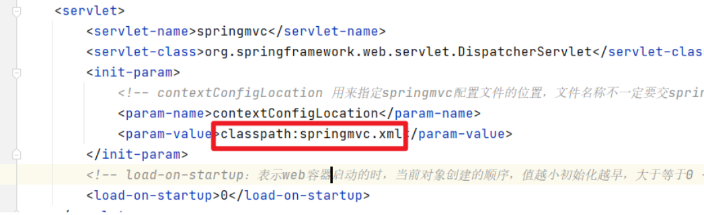
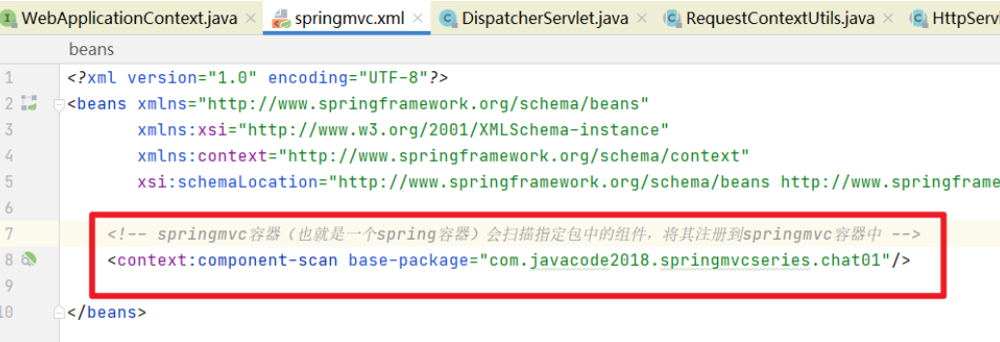

# SpringMVC处理器的请求过程
## 详细的过程
1. tomcat启动的时候，会初始化DispatcherServlet，DispatcherServlet中会创建一个SpringMVC容器，其中就是我们熟悉的Spring容器（ApplicationContext），只不过这个容器的类型是（WebApplicationContext），此容器会加载web.xml中contextConfigLocation指定的springmvc配置文件。

2. 由于springmvc.xml中指定了扫描包的规则，而HelloController符合这个扫描规则，所以会被注册到springmvc容器中。

3. 当发起*.do请求的时候，请求会达到DispatcherServlet中央处理器，中央处理器会根据请求路径，去springmvc容器中找到能够处理找到能够处理这个请求的方法，具体由哪个方法来处理这个请求呢？   
这里就是通过@RequestMapping来匹配的，这个注解可以将请求和方法进行映射，匹配的请求会被@RequestMapping标注的方法处理，所以在这个步骤中springmvc容器会发现HelloController这个bean的hello方法可以处理/hello.do请求   
4. DispatcherServlet中通过反射来调用HelloController这个bean的hello方法    
5. DispatcherServlet接收到了hello方法的返回值   
6. DispatcherServlet根据hello方法的返回值，做跳转操作，相当于 `request.getRequestDispatcher("/WEB-INF/view/hello.jsp").forward(request, response);`   

## 简化过程
**客户端发起请求-->到达tomcat-->tomcat发现请求是*.do的请求-->tomcat将请求转发给中央调度器DispatcherServlet-->中央调度器根据url将请求转发给我们自定义的Controller-->DispatcherServlet根据Controller的返回结果做跳转操作-->将结果输出到客户端** 
