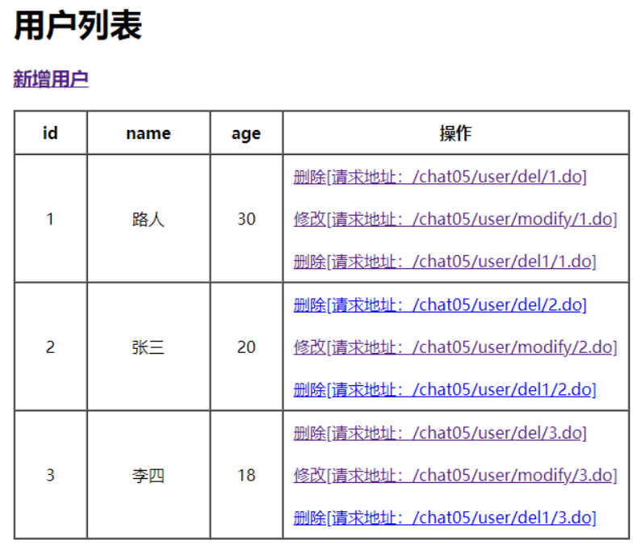

# 返回页面常见的5种方式
本文内容   
- springMVC返回页面的3种方式级区别
- springMVC重定向的2种方式及区别

## servlet中响应页面的2种方式
SpringMVC底层是依靠Servlet来实现的，所以我们先回顾下Servlet中响应页面是如何实现的。   
Servlet中响应页面有2种常见的方式，而SpringMVC中通常也是依靠这2种方式实现的。   
### 方式一：转向
`request.getRequestDispatcher(path).forward(request, response);`   
1. path为转向地址；
2. 发生在服务器端，浏览器的地址栏不会发生变化；
3. path指定的页面，可以共享request请求中的数据；
4. path必须是服务器端的资源；
### 方式二：重定向
`response.sendRedirect(location);`   
1. location为重定向的地址
2. 重定向发生在客户端（浏览器端），所以会导致浏览器地址栏发生变化，变为location指定的地址。 
3. 重定向会导致浏览器重新向服务器端发送一次请求，请求地址为location指定的地址
4. location可以为本服务器端的资源，也可以为外网可以访问的任意资源。
## springmvc中响应页面的5种方式
### 方式一：返回ModelAndView
**需求**   
通过SpringMVC显示用户列表，如下图：   

**如何实现？**   
我们先来看一下如果用Servlet是如何实现的，伪代码如下：   
```text
List<UserDto> userList = new ArrayList();
request.setAttribute("userList", userList);
request.getRequestDispatcher("/WEB-INF/view/user/list.jsp").forward(request, response);
```
关键代码就这几行，相当简单。   
对应jsp(/WEB-INF/view/user/list.jsp)代码如下，主要就是一个循环遍历用例列表userList，然后显示：   
```html
<table border="1" cellpadding="10" cellspacing="0">
    <tr>
        <th width="50">id</th>
        <th width="100">name</th>
        <th width="50">age</th>
    </tr>
    <c:forEach items="${userList}" var="user">
        <tr align="center">
            <td>${user.id}</td>
            <td>${user.name}</td>
            <td>${user.age}</td>
        </tr>
    </c:forEach>
</table>
```
**使用springmvc实现**

```java
import org.springframework.web.bind.annotation.RequestMapping;
import org.springframework.web.servlet.ModelAndView;

import java.util.concurrent.ConcurrentHashMap;

public class UserController {
    /**
     * 用户列表（用户id->用户信息）
     */
    Map<Long, UserDto> userDtoMap = new ConcurrentHashMap<>();

    {
        userDtoMap.put(1L, newUserDto(1L, "java", 22));
        userDtoMap.put(2L, newUserDto(2L, "mybatis", 12));
        userDtoMap.put(3L, newUserDto(3L, "spring", 2));
    }

    /**
     * 用户列表
     */
    @RequestMapping("/user/list.do")
    public ModelAndView list() {
        //1.创建ModelAndView
        ModelAndView modelAndView = new ModelAndView();
        //2.将所有用户信息放到Model中
        modelAndView.addObject("userList", userDtoMap.value());
        //3.设置显示的页面
        modelAndView.setViewName("WEB-INF/view/user/list.jsp");
        //4.返回ModelAndView
        return modelAndView;
    }
}
```
这里主要看list()方法，当调用这个方法的时候，最终效果和上面Servlet的效果一样，这里用到了ModelAndView。   
**ModelAndView: 模型&视图**   
通常我们的页面都是动态的，客户端看到的页面，基本上都是模板（视图）+数据（数据模型），经过组装之后输出到客户端的。   
所以响应客户端的请求，需要指定2个关键的信息：页面，页面中需要的数据。   
SpringMVC中就使用ModelAndView来存放着2个关键的信息，通过modelAndView.addObject方法来添加页面中需要用到的数据，通过modelAndView.setViewName("视图名称")来设置需要显示的页面。   
`modelAndView.addObject("key", "value");`   添加页面中需要用到的数据，效果同：`request.setAttribute("key", "value");`   
`modelAndView.setViewName("视图名称”);`   指定需要显示的视图名称，比如jsp地址。   
**小结**   
如果页面中需要用到一些动态的数据，此时可以使用ModelAndView作为返回值，将动态数据放到ModelAndView中。   
### 方式二：直接返回视图名称
当页面不需要用到后端的数据的时候，就只是显示一个页面，此时可以直接将视图的名称作为返回值就可以了，比如：

```java
/**
 * 跳转到新增页面
 */

import org.springframework.web.bind.annotation.RequestMapping;

public class Demo {
    @RequestMapping("/user/add.do")
    public String add() {
        //直接返回视图的名称（页面的路径）
        return "/WEB-INF/view/user/add.jsp";
    }
}
```
### 方式三：指定视图解析器
**存在的问题**   
上面2种方式，返回的视图名称，都以/WEB-INF/view开头，以.jsp结尾。   
如果项目中我们规定所有的视图都符合这种规则，即都放在/WEB-INF/view/目录中，都是jsp文件，那么我们可以将视图的名称是不是可以简化一下，怎么做呢？   
具体2个步骤   
**step1: 注册视图解析器**   
> 在SpringMVC配置文件中添加下面的配置，来指定视图解析器。   
> 这个bean会对视图的名称进行处理，有2个参数需要指定：
> prefix: 视图文件前缀
> suffix: 视图文件后缀
> 最终视图的名称 = prefix+controller中指定的viewname+suffix
```text
<!--添加视图解析器-->
<bean id="viewResolver" class="org.springframework.web.servlet.view.InternalResourceViewResolver">
        <property name="prefix" value="/WEB-INF/view/"/>
        <property name="suffix" value=".jsp"/>
</bean>
```
**step2: 调整controller中视图的名称**   
|viewName旧值|新值|
|-----|-----|
|/WEB-INF/view/user/add.jsp|user/add|
|/WEB-INF/view/user/list.jsp|user/list|

```java
import org.springframework.web.bind.annotation.RequestMapping;

public class Demo {
    @RequestMapping("/user/add.jsp")
    public String add() {
        //直接返回视图的名称（页面的路径）
        return "user/add";
    }
}
```
## SpringMVC实现重定向的2种方式
**需求**   
有时候，请求之后，需要做重定向操作，比如发送删除用户信息的请求/user/del/{用户ID}.do，后端处理成功之后，需要重定向到用户列表页面/user/list.do。   
这里就需要用到重定向的操作了，在servlet中的对应代码是：   
`response.sendRedirect(location);`   
springmvc中有好几种实现，这里我们主要掌握2种。   
### 方式一：返回String类型
SpringMVC中实现重定向比较简单，视图的名称必须以`redirect:`开头，比如下面代码，处理删除用户的请求，删除成功之后，重定向到用户列表页面。

```java
import org.springframework.web.bind.annotation.GetMapping;
import org.springframework.web.bind.annotation.PathVariable;

public class Demo {
    @GetMapping("/user/del/{userId}.do")
    public String del(@PathVariable("userId") Long userId, HttpServletRequest request) {
        //删除用户信息
        this.userDtoMap.remove(userId);
        //重定向到用户列表页面，此时浏览器地址会发生变化，变为http://localhost:8080/chat05/user/list.do
        return "redirect:/user/list.do";
    }
}
```
### 方式二：返回ModelAndView类型
如果重定向的时候，我们需要向重定向的页面携带参数，一般我们可以这么做，代码如下：   
`return "redirect:/user/list.do?在这里拼参数“;`
比如   
`return "redirect:/user/list.do?p1=v1&p2=v2“;`
如果遇到了这种请求，参数比较少的情况，按照上面拼接是可以的。   
springmvc中提供了更简单的方式，代码如下，最终springmvc会指定将ModelAndView中添加的数据，拼接到重定向的url中

```java
import org.springframework.web.bind.annotation.GetMapping;
import org.springframework.web.bind.annotation.PathVariable;
import org.springframework.web.servlet.ModelAndView;

public class Demo {
    @GetMapping("/user/del/{userId}.do")
    public ModelAndView del(@PathVariable("userId") Long userId) {
        //删除用户记录
        this.userDtoMap.remove(userId);
        /**
         * 重定向到用户列表页面，此时浏览器地址会发生变化
         * 变为http://localhost:8080/chat05/user/list.do?p1=v1&p2=v2
         */
        ModelAndView modelAndView = new ModelAndView();
        modelAndView.addObject("p1", "v1");
        modelAndView.addObject("p2", "v2");
        modelAndView.setViewName("redirect:/user/list.do");
        return modelAndView;
    }
}
```
## 总结
- 响应式页面通常有2种方式，第一种返回ModelAndView，这种方式比较适合页面中需要后端传递数据的，第二种方式直接返回视图的名称，这种适合无需传递数据的。
- springmvc容器中配置InternalResourceViewResolver视图解析器，用来简化controller中视图的名称
- 掌握重定向的2种方式，重定向的关键点是视图名称要以`redirect:`开头，这样springmvc才知道你需要springmvc来帮你执行重定向操作。