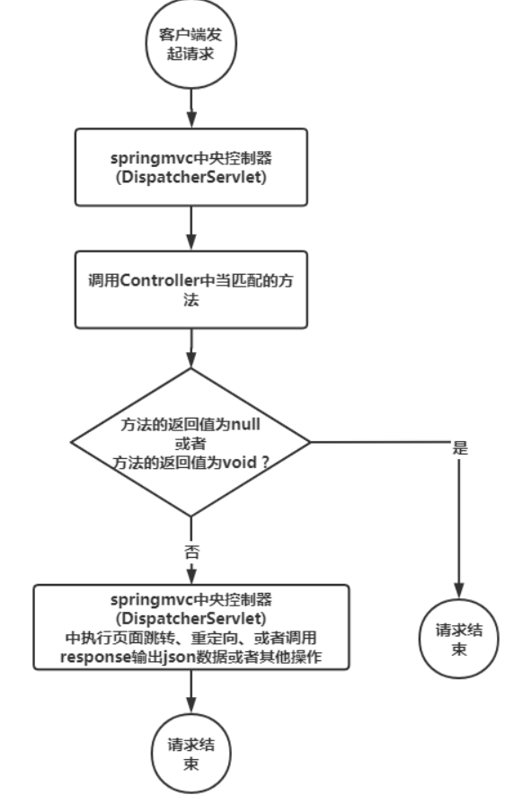

# SpringMVC返回null是什么意思？
到目前为止，SpringMVC系列中，已经介绍了大量的Controller的用法，目前所有的Controller中的方法接收到请求之后，都是有返回值的，返回值主要有2种类型：   
1. 输出的是页面：也就是视图（会向客户端输出页面），此时方法的返回值可以是String(视图名称)、ModelAndView（页面中有数据的情况）。   
2. 输出的是json格式的数据：需要用到@ResponseBody注解   
这2种情况中，都是SpringMVC来处理返回值的，接受到返回值之后，会调用response来进行页面跳转或者调用输出流将json格式的数据输出。   
当方法的返回值为void或者方法中返回null的时候，SpringMVC会怎么处理呢？

```java
import org.springframework.web.bind.annotation.GetMapping;

public class Demo {
    @GetMapping("/test1")
    public void test1() {
        
    }
    @GetMapping("/test2")
    public Object test2() {
        return null;
    }
}
```
**当出现上面这2种情况的时候，SpringMVC调用这些方法之后，请求就结束了，springMVC会认为在控制器的方法中响应已经被处理过了，不需要springmvc去处理了。*   
## SpringMVC处理流程

## 使用场景
当响应结果比较复杂的时候，SpringMVC无法处理这些响应结果的时候，我们可以在控制器的方法中使用response来主动控制输出的结果。   
比如下载文件、断点下载等比较复杂的响应，此时我们可以在处理器的方法中使用HttpServletResponse来自己控制输出的内容，可以执行更细粒度的操作。   
## 总结
到目前为止，我们主要掌握了3种类型的返回值：
1. 返回视图，即页面，此时返回值可以是String(视图名称)、或者ModelAndView
2. 返回json格式数据，此时需要用到@ResponeBody
3. 方法返回值是void或者null，此时需要我们在方法中自己通过HttpServletResponse对象来主动向客户端输出结果。   
